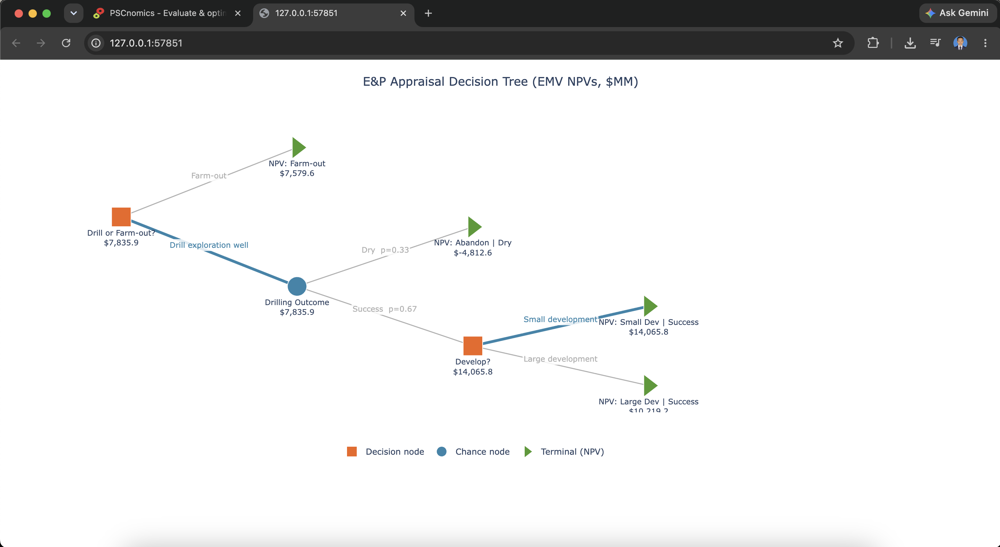

# PySCnomics-Extended

An extended version of **PySCnomics** focused on advanced project economic evaluation, fiscal optimization, and risk-aware decision analysis for upstream oil and gas projects.

PySCnomics-Extended expands the capabilities of the original **PySCnomics** framework by providing advanced methodologies for uncertainty analysis, investment optimization, and decision support in petroleum economic evaluation.

---

# 🚀 Current Features and Development Roadmap

| Module | Status |
|---------|:------:|
| Decision Tree Analysis (DTA) | ✅ |
| Real Options Analysis | 🚧 |
| Value at Risk (VaR) & Conditional VaR (CVaR) | 🚧 |
| Mixed Integer Linear Programming (MILP) Optimization | 🚧 |

---

# Decision Tree Analysis (DTA)

PySCnomics-Extended provides a complete **Decision Tree Analysis (DTA)** framework for evaluating petroleum investment decisions under uncertainty.

The implementation is fully object-oriented and integrates directly with existing **PySCnomics** contract objects. Terminal node values are evaluated automatically by executing the associated project contract and retrieving the project's Net Present Value (NPV).

The module is located at

```python
pyscnomics.extension.decision_tree
```

Terminal node values are automatically obtained using

```python
contract.get_summary(**summary_args)["NPV"]
```

---

## Supported Node Types

- Decision Nodes
- Chance Nodes
- Terminal Nodes

---

## Features

- Automatic Expected Monetary Value (EMV) calculation
- Automatic optimal decision selection
- Chance node probability weighting
- Direct integration with PySCnomics PSC contracts
- Automatic NPV evaluation from contract objects
- Interactive Plotly visualization
- HTML export for interactive reports
- Object-oriented and extensible architecture

---

# Example

The following example evaluates whether an exploration prospect should be drilled or farmed out.

```python
from sample.sample_contract_abandon import project as project_abandon
from sample.sample_contract_small_dev import project as project_small_dev
from sample.sample_contract_large_dev import project as project_large_dev
from sample.sample_contract_dry import project as project_dry

from sample.sample_contract_abandon import fiscal as fiscal_abandon
from sample.sample_contract_small_dev import fiscal as fiscal_small_dev
from sample.sample_contract_large_dev import fiscal as fiscal_large_dev
from sample.sample_contract_dry import fiscal as fiscal_dry

from sample.sample_contract_abandon import summary_parameter as summary_abandon
from sample.sample_contract_small_dev import summary_parameter as summary_small_dev
from sample.sample_contract_large_dev import summary_parameter as summary_large_dev
from sample.sample_contract_dry import summary_parameter as summary_dry

from pyscnomics.extension.decision_tree import (
    NodeType,
    Branch,
    Node,
    DecisionTree,
)

# Success branch
dev_large_success = Node(
    name="NPV: Large Dev | Success",
    node_type=NodeType.TERMINAL,
    contract=project_large_dev,
    contract_args=fiscal_large_dev,
    summary_args=summary_large_dev,
)

dev_small_success = Node(
    name="NPV: Small Dev | Success",
    node_type=NodeType.TERMINAL,
    contract=project_small_dev,
    contract_args=fiscal_small_dev,
    summary_args=summary_small_dev,
)

develop_decision = Node(
    "Develop?",
    NodeType.DECISION,
    maximize=True,
)

develop_decision.add_branch(
    Branch("Large development", dev_large_success)
)

develop_decision.add_branch(
    Branch("Small development", dev_small_success)
)

# Dry branch
abandon = Node(
    name="NPV: Abandon | Dry",
    node_type=NodeType.TERMINAL,
    contract=project_dry,
    contract_args=fiscal_dry,
    summary_args=summary_dry,
)

# Chance node
drill_outcome = Node("Drilling Outcome", NodeType.CHANCE)

drill_outcome.add_branch(
    Branch("Success", develop_decision, probability=0.67)
)

drill_outcome.add_branch(
    Branch("Dry", abandon, probability=0.33)
)

# Farm-out alternative
farm_out = Node(
    name="NPV: Farm-out",
    node_type=NodeType.TERMINAL,
    contract=project_abandon,
    contract_args=fiscal_abandon,
    summary_args=summary_abandon,
)

# Root decision
root = Node(
    "Drill or Farm-out?",
    NodeType.DECISION,
    maximize=True,
)

root.add_branch(
    Branch("Drill exploration well", drill_outcome)
)

root.add_branch(
    Branch("Farm-out", farm_out)
)

tree = DecisionTree(
    root,
    title="E&P Appraisal Decision Tree (EMV NPVs, $MM)"
)

ev = tree.evaluate()

print(f"Root expected value: ${ev:,.2f} MM")
print(f"Optimal top-level choice: {root.optimal_branch}")
print(f"Optimal development choice: {develop_decision.optimal_branch}")

fig = tree.plot()

fig.write_html("decision_tree.html")

fig.show()
```

---

# Example Output

The following figure was generated directly from the example above.

<p align="center">
  
</p>

<p align="center">
<b>Figure 1.</b> Interactive Decision Tree Analysis generated by PySCnomics-Extended.
</p>

The generated visualization includes

- Decision nodes
- Chance nodes
- Terminal NPVs
- Branch probabilities
- Expected Monetary Values (EMV)
- Automatically selected optimal decision paths
- Color-coded node types
- Interactive zooming and panning
- Hover information for every node and branch

The interactive Plotly figure can be generated with

```python
fig = tree.plot()
fig.write_html("decision_tree.html")
fig.show()
```

The exported HTML file allows users to

- Zoom and pan
- Hover over nodes and branches
- Explore complex decision trees interactively
- Export publication-quality images directly from Plotly

---

# Installation

Install directly from GitHub

```bash
pip install git+https://github.com/adhimmulia/pyscnomics-Extended.git
```

---

# Recommended Environment

- Python ≥ 3.11
- Plotly
- NumPy
- Pandas
- Original PySCnomics package

---

# Repository Structure

```
PySCnomics-Extended/
│
├── docs/
│   └── images/
│       └── decision_tree_example.png
│
├── pyscnomics/
│   └── extension/
│       └── decision_tree.py
│
├── sample/
│
├── README.md
│
└── ...
```

---

# Development Status

PySCnomics-Extended is currently under active development. Future releases will continue to expand the library with advanced economic evaluation methodologies for upstream oil and gas projects.

Upcoming modules include

- Real Options Analysis
- Value at Risk (VaR)
- Conditional Value at Risk (CVaR)
- Mixed Integer Linear Programming (MILP)
- Additional uncertainty quantification and optimization workflows

Contributions, suggestions, and feature requests are welcome.

---

# Acknowledgment

PySCnomics-Extended builds upon the original **PySCnomics** framework and aims to provide advanced decision analysis, fiscal evaluation, optimization, and uncertainty assessment methodologies for petroleum economic analysis.